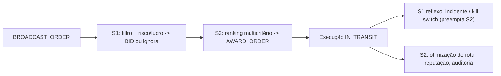

# Especificação Técnica — Open UDP v0.1

**Language**: [🇧🇷 Português](#1-visão-geral) | [🇺🇸 English](#1-overview)

**Namespace:** `u.delivery`  
**Base:** [Open USP — Specification](https://github.com/LucasArgate/open-usp/blob/main/manifest/specification.md)

---

## 1. Visão Geral

Esta especificação define o comportamento de agentes e serviços no protocolo Open UDP (Universal Delivery Protocol), operando sob o namespace `u.delivery`. O UDP é um **protocolo próprio** para o domínio Last Mile, compatível com o ecossistema Open USP — não uma extensão.

O Open UDP opera em um modelo de **mercado descentralizado (P2P/Broadcast)** em que **Requesters** publicam intenções de entrega e **Providers** respondem com ofertas (Bids).

### 1.1 Atores do sistema

| Ator | Descrição |
|------|-----------|
| **Requester** | Agente que inicia o pedido (restaurante, e-commerce, consumidor). |
| **Provider** | Agente que executa a logística (motoboy, ciclista, drone). |
| **Observer** | Entidade opcional de auditoria/seguro (cooperativa, seguradora). |

### 1.2 Versão

**Versão atual:** 0.1.0

---

## 2. Fluxo de negociação (The Handshake)

O ciclo de vida de uma entrega segue o padrão **Broadcast → Bid → Award**.

### 2.1 Fase 1: Descoberta — `BROADCAST_ORDER`

O Requester emite uma mensagem para a rede (via PubSub, DHT ou API de Relay) anunciando a necessidade de transporte.

- **Campos obrigatórios:** `origin`, `destination`, `cargo` (ou `cargo_type`), `pickup_time` (ou janela em `constraints`).
- **Campos opcionais:** `offer.amount` (preço sugerido), `constraints` (ex.: `must_be_human`).

### 2.2 Fase 2: Análise e lance — `SUBMIT_BID`

Os agentes Provider na região recebem o broadcast.

1. **Filtro local:** O agente verifica se a rota é viável (raio de atuação, bateria/combustível).
2. **Cálculo de risco:** O agente pode consultar APIs de clima e segurança. Se chover ou a área for de risco, o custo pode subir (Risk Premium).
3. **Envio de lance:** Se interessar, o agente envia um `BID` assinado.
   - O BID pode ser maior ou menor que o preço sugerido.
   - O BID inclui `eta_pickup` (tempo estimado até o pickup).

### 2.3 Fase 3: Seleção — `AWARD_ORDER`

O Requester recebe múltiplos BIDs.

1. **Ranking:** Ordena por preço, reputação ou tempo (critério do Requester).
2. **Seleção:** Escolhe um vencedor e emite `AWARD_ORDER`.
3. **Contrato:** Termos finais e, quando aplicável, smart contract ou ledger de confiança com os termos acordados.

---

## 3. Processo dual (S1/S2): pensar rápido e devagar

Os agentes do UDP (Requester e Provider) operam em **dois modos cognitivos** inspirados na teoria do processo dual de Kahneman (2011): **S1 (pensar rápido)** e **S2 (pensar devagar)**. Diferentemente do UHP — onde S1 e S2 são **camadas/atores distintos** (borda vs. núcleo) — no UDP os dois modos **coexistem no mesmo Agente Pessoal**, no mesmo dispositivo de borda. Não é onde o agente roda, é **como ele decide**.

| | **S1 — pensar rápido (reflexo)** | **S2 — pensar devagar (deliberação)** |
|---|---|---|
| **Função** | Reação em tempo real: filtro local (raio, bateria/combustível), heurística de risco/lucro, lance ou ignorar, reflexos de segurança | Análise: ranking multicritério, seleção do `AWARD_ORDER`, otimização de rota multi-pedido, reputação, disputa, governança |
| **Quando** | Na chegada do `BROADCAST_ORDER` e durante `IN_TRANSIT` | Antes do `AWARD_ORDER` e fora do caminho crítico |
| **Risco** | Viés/erro sob pressão, auto-aceite abusivo | Latência (lento demais para um incidente ao vivo) |

### 3.1 Mapeamento ao handshake

| Fase | Modo dominante | Comportamento |
|------|----------------|---------------|
| `BROADCAST_ORDER` | S2 (Requester) | Compõe a ordem deliberadamente; pode ser disparada por regra S1 (ex.: gatilho de reposição/estoque). |
| `SUBMIT_BID` | **S1 (Provider)** | Filtro local + heurística de risco/lucro decidem dar lance ou ignorar em segundos; S2 assessora (Risk Budget, rota multi-pedido). |
| `AWARD_ORDER` | **S2 (Requester)** | Ranking multicritério e seleção deliberada. Atalho S1 (auto-award) permitido quando lance está abaixo de limiar e a reputação é confiável. |
| `UPDATE_STATUS` / `REPORT_INCIDENT` | **S1 (Provider)** | Reflexos na borda: marcos de execução e detecção de incidente (ver [security.md](./security.md)). |

### 3.2 Bypass de emergência (S1 preempta S2)

Durante a rota ativa (`IN_TRANSIT`), os **reflexos S1 de segurança** (detecção de incidente, kill switch, geofence) **preemptam** a deliberação S2, com **reporte determinístico posterior**. Nenhuma análise lenta deve ficar no caminho crítico de um incidente físico. Esse princípio espelha o árbitro de emergência do UHP (§6.4), adaptado à segurança física do entregador.

---

## 4. Execução e estados

Após o `AWARD_ORDER`, a entrega entra em execução com os seguintes estados:

| Estado | Descrição |
|--------|-----------|
| `ACCEPTED` | Provider aceitou e está a caminho do pickup. |
| `ARRIVED_PICKUP` | Provider chegou no ponto de retirada. |
| `IN_TRANSIT` | Provider pegou o pedido (prova: scan QR ou assinatura). |
| `ARRIVED_DROPOFF` | Provider chegou no destino. |
| `DELIVERED` | Cliente recebeu (prova: scan QR ou assinatura). |
| `CANCELLED` | Cancelado por uma das partes (com penalidade, salvo força maior). |
| `FROZEN` | Incidente reportado; entrega pausada para tratamento. |

### 4.1 Transições com prova

Para evitar fraude, as transições críticas **IN_TRANSIT** e **DELIVERED** devem ser acompanhadas de prova criptográfica (assinatura do restaurante/cliente ou scan de token físico), conforme [security.md](./security.md).

---

## 5. Tratamento de exceções

### 5.1 Incidentes (Safety)

Se o Provider reportar `REPORT_INCIDENT` (acidente, crime, pane), o estado pode mudar para `FROZEN`.

- A reputação do Provider não é afetada negativamente por incidente legítimo.
- O pagamento proporcional ao trajeto percorrido deve ser garantido quando houver seguro ou termos acordados.

### 5.2 Atraso excessivo

Se o Provider exceder o ETA acordado em um percentual definido no contrato, o Requester pode cancelar sem multa e reabrir o broadcast.

### 5.3 Cancelamento

Regras de cancelamento e penalidades ficam definidas no contrato (ver [contracts.md](./contracts.md)); o protocolo não impõe um único modelo.

---

## 6. Extensibilidade

O protocolo permite extensões via campo `meta`, por exemplo:

- `meta.delivery.thermal_bag_required`: boolean
- `meta.payment.credit_card_machine`: boolean
- `meta.delivery.handoff_supported`: boolean

Detalhes em [extensions.md](./extensions.md).

---

## 7. Referências

- [Open USP — Especificação](https://github.com/LucasArgate/open-usp/blob/main/manifest/specification.md)
- [Open UDP — Segurança](./security.md)
- [Open UDP — Mensagens](./messages.md)
- [Open UDP — Contratos](./contracts.md)

---

**Versão:** 0.1.0  
**Última atualização:** Fevereiro 2026
